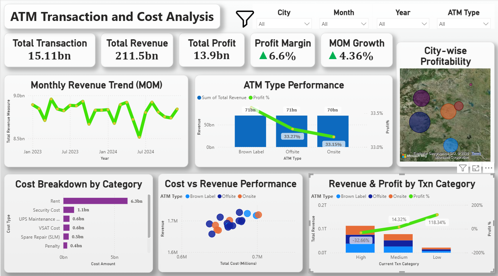

# ATM-Transaction-and-Cost-Analysis

## 📥 Download Full Files

Due to GitHub file size limitations, the complete dataset and Power BI dashboard are shared via Google Drive:

- 📊 Power BI Dashboard (.pbix): https://drive.google.com/drive/folders/1c5XKhCRGfhv4UPO5kkBvq3ydCv1Ekuqu?usp=drive_link
- 📁 Full Dataset (300K+ rows): https://drive.google.com/drive/folders/1c5XKhCRGfhv4UPO5kkBvq3ydCv1Ekuqu?usp=drive_link

A smaller sample dataset is included in this repository for reference.

# 📊 ATM Transaction and Cost Analysis

An end-to-end data analysis project to simulate and analyze ATM transactions, operational costs, and profitability using Python, SQL, and Power BI.

---

## 🚀 Project Overview

This project focuses on building a complete data pipeline from data generation to business insights.

A realistic dataset of 300K+ ATM transactions was created and processed to understand revenue trends, cost distribution, and overall profitability.

---

## 🔄 Workflow

Python → SQL → Power BI

- Python: Data generation and preprocessing  
- SQL: Data transformation and aggregation  
- Power BI: Dashboard creation and insights  

---

## 🐍 Python (Data Generation & Cleaning)

- Generated 300K+ synthetic ATM transaction records  
- Created fields such as transaction amount, revenue, cost, ATM type, city, and date  
- Applied business logic for revenue and cost calculations  
- Cleaned data by handling nulls, duplicates, and formatting issues  

---

## 🗄 SQL (Data Transformation)

- Loaded dataset into SQL for analysis  
- Performed aggregations (SUM, COUNT)  
- Grouped data by city, ATM type, and category  
- Created key metrics:
  - Total Revenue  
  - Total Cost  
  - Total Profit  

---

## 📊 Power BI (Dashboard & Insights)

- Built an interactive dashboard with:
  - KPI cards (Revenue, Cost, Profit, Profit %)  
  - Monthly trend analysis (MoM growth)  
  - Cost breakdown by category  
  - City-wise and ATM-type performance  
  - Map visualization for geographic insights  

- Added slicers for dynamic filtering:
  - City  
  - ATM Type  
  - Year / Month  

---

## 📈 Key Insights

- Identified major cost drivers affecting profitability  
- Compared performance across different ATM types  
- Analyzed monthly revenue trends and growth patterns  
- Highlighted high and low performing cities  

---

## 🛠 Tools & Technologies

- Python (Pandas, NumPy)  
- SQL  
- Power BI  
- Excel
  
---

## 📂 Project Structure

- **📓Notebooks/**
  - atm_data_generation.ipynb

- **📁Data/**
  - sample_atm_data.csv

- **🗄SQL/**
  - atm_analysis.sql

- **🖼Images/**
  - dashboard.png

- **README.md**

---

## 📸 Dashboard Preview

---

## 💡 Key Learnings

- Built an end-to-end data pipeline from scratch  
- Learned how to structure and transform large datasets  
- Understood the importance of data modeling  
- Improved dashboard design for business decision-making  

---

## 📌 Future Improvements

- Add Year-over-Year (YoY) and advanced time-based analysis  
- Integrate real-world data sources  
- Optimize data model for performance  

---

## 🤝 Feedback

Open to suggestions and feedback to improve this project.
